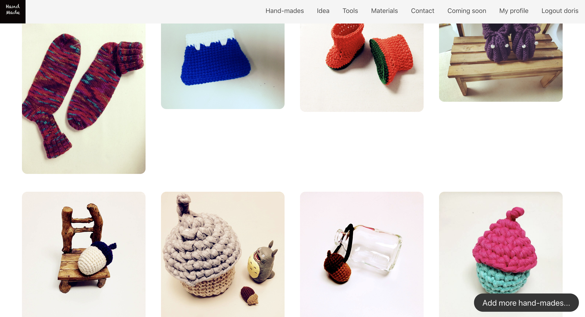
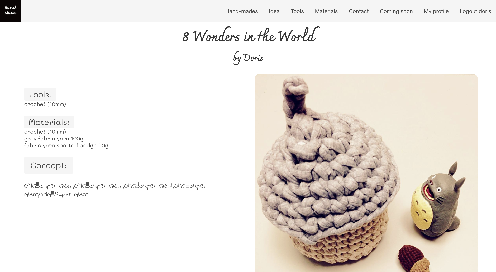
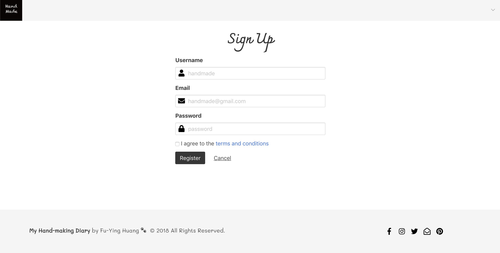
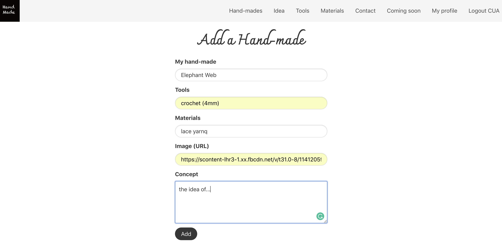
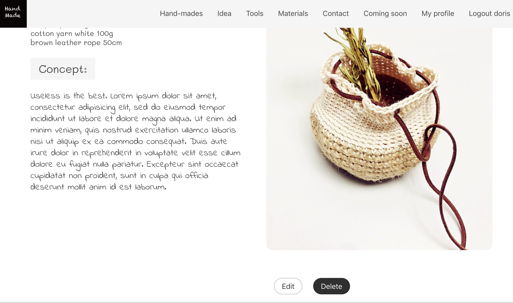
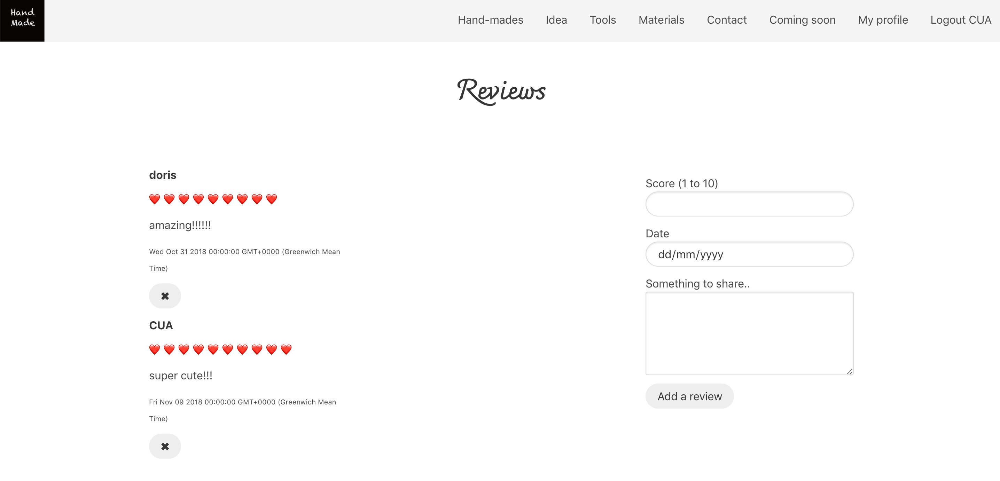
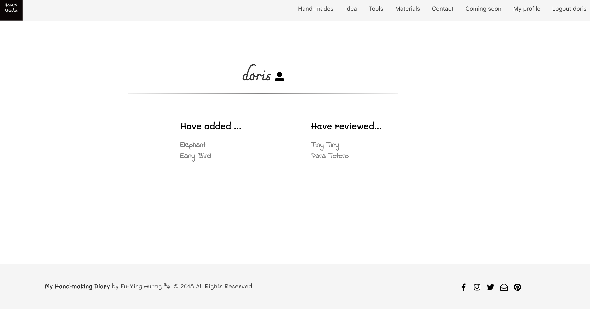

# General Assembly WDI Project 2: My Hand-making Diary

[Heroku Pages](https://my-hand-making-diary.herokuapp.com/)

[GitHub Repo](https://github.com/huangfuin1101/wdi-project-two-My-hand-making-Diary)

###

## Home page

## Log in mode

## Index page

## Show page

## Sign up page

## Create page

## Edit and delete

## Review page

## Profile page

## Technologies Used

* Git
* GitHub
* Heroku
* Node.js
* MongoDB
* express: v4.16.4
* express-ejs-layout: v2.5.0
* ejs: v2.6.1
* express-session: v1.15.6
* body-parser: v1.18.3
* mongoose: v5.3.7
* method-override: v3.5.0
* JavaScript (ECMAScript 6)
* CSS3 with animation
* Bulma
* Google Fonts
* Fontawesome

### Functionality

### Brief

### Featured Piece of Code

### Styling

### Future Features
There are some features I would like to add in the future:
